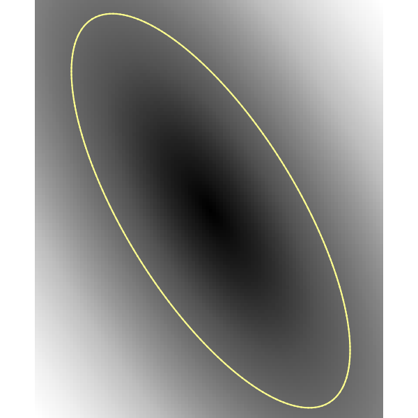
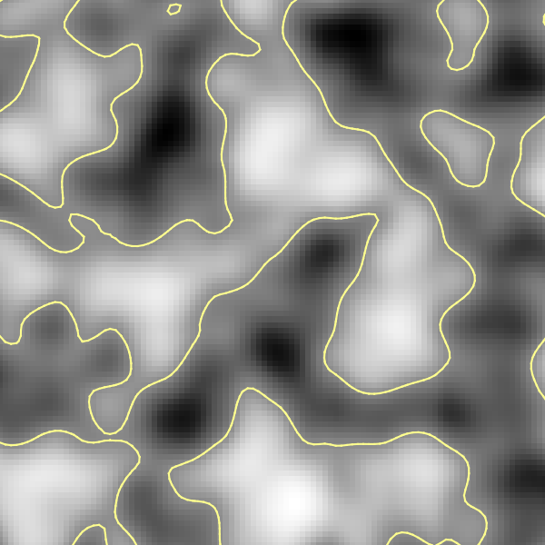

# Marching Squares
Python implementation of Marching Squares on grayscale images.

## The Marching Squares algorithm
The Marching Squares algorithm aims to create contours for a scalar field. In terms of images, this can be thought of as grayscale-valued raster images.

The algorithm generate contours by seperating scalars in the given field depending on whether they are greater or less than some given thresholds. In details, the seperation is done with groups of 4 adjacent scalars, forming the corners of a square-shape grid (hence the name), by drawing edges such that scalars of the same characteristics should be in the same isoband (essentially contour level).\
For only one given threshold, the scalars have two states (less than or greater than the threshold). Hence each groups can be thought of a 4-bit numbers, giving a total of 16 combinations, that is, 16 ways to draw edges. An illustration of such rules are found [here](https://www.baeldung.com/wp-content/uploads/sites/4/2022/06/diagram-20220522-4.png), this is also the rules implemented in the code.

For more information, visit [Marching Squares](https://en.wikipedia.org/wiki/Marching_squares).

## The code
The code is provided in `/src/marching_squares`. There are currently a raw algorithm and a class wrapper for the algorithm.

The raw algorithm can run on any 2D matrices containing scalars. For colored images, consider converting them to grayscale or any other means to encode the color tuple.

The class wrapper runs the algorithm on noisemaps generated using Perlin Noise.

Please check out `/src/demo.ipynb` for examples.
